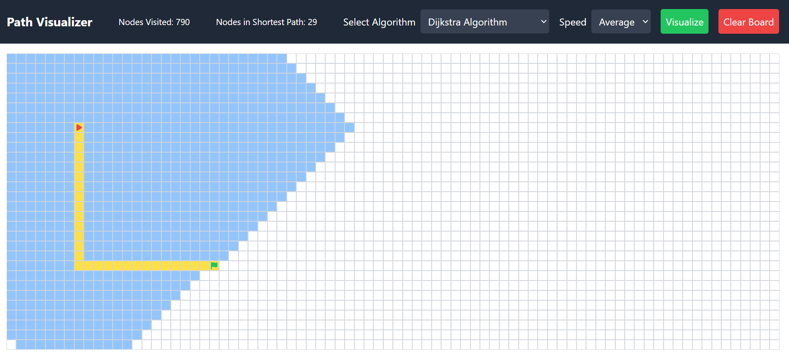

# Pathfinding Visualizer

Pathfinding Visualizer is a web application that visualizes various pathfinding algorithms to find the shortest path between a source node cell and an end node cell. The application allows users to interact with the grid by adding obstacles and dragging the start and end points. The visualization helps in understanding how different algorithms work in finding the shortest path.



## Technologies Used

- **React.js (Vite)**: The core framework used for building the application.
- **Tailwind CSS**: Used for styling the application.
- **Intro.js (react-intro.js)**: Provides a guided introduction to the application.

## Objective

To find the shortest path between the source node cell and the end node cell and visualize the process using various pathfinding algorithms.

## Algorithms Implemented

1. Dijkstra
2. A*
3. Greedy Best First Search
4. BFS (Breadth-First Search)
5. DFS (Depth-First Search)

## Features

- **Speed Options**: Users can select from three speed options - Slow, Average, and Fast.
- **Start Point**: Represented with a red play icon. The start point is draggable.
- **End Point**: Represented with a green flag. The end point is draggable.
- **Obstacles**: Users can toggle any cell to add a hurdle, indicating that the node cannot

## Installation and Setup

Follow these steps to run the project on your local machine:

### Prerequisites

- Node.js and npm should be installed on your machine. You can download them from [Node.js](https://nodejs.org/).

### Steps

1. **Clone the Repository**

   ```bash
   git clone https://github.com/rohitmultani/ShortestPathVisualizer
   
2. **Clone the Repository**


    ```bash
    npm install
3. **Run the Development Server**

    ```bash
    npm run dev

### Usage

1. Select Algorithm: Choose an algorithm from the dropdown menu in the navigation bar.
2. Adjust Speed: Select the visualization speed from the speed dropdown menu.
3. Visualize: Click the "Visualize" button to start the algorithm visualization.
4. Clear Board: Click the "Clear Board" button to reset the grid.
5. Drag Start/End Points: Drag the red play icon (start point) and the green flag (end point) to set new positions.
6. Add Obstacles: Click on any cell to toggle an obstacle (hurdle) on or off.
